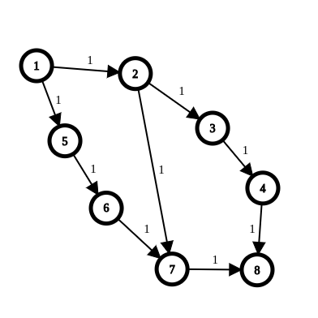

### max_flow

#### descriere
  * Flux maxim intr-o retea de transport
    * Solutie: `Edmonds Karp` - 
`
    * Gaseste mereu o cale de ameliorare. Creste fluxul pe aceasta. Cand nu mai gaseste o astfel de cale, fluxul prin retea este maxim.

  	* `Complexitate`: 
  	  * `T = O(n * m^2)` 
  	  * `S = O(n ^ 2)`

#### lab
 
