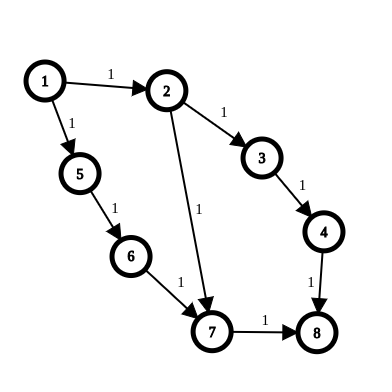

### max_flow

#### descriere
  * Flux maxim intr-o retea de transport
    * Solutie: `Edmonds Karp` 
`
    * Gaseste mereu o cale de ameliorare. Creste fluxul pe aceasta. Cand nu mai gaseste o astfel de cale, fluxul prin retea este maxim.

  	* `Complexitate`: 
  	  * `T = O(n * m^2)` 
  	  * `S = O(n ^ 2)`

``` cpp
// pompeaza flux maxim de la sursa S la terminalul T
int Edmonds-Karp(G(V, E), S, T) {
	// initial nu am flux in retea
	maxFlow = 0
	foreach ( (u, v) in VxV ) {
		f[u][v] = 0
	}

	// cat timp exista un DRUM DE AMELIORARE de la S la T
	while ( BFS(S, T) == TRUE ) {
		d = drumul de ameliorare gasit de BFS

		// calculeaza cu cat poate fi marit fluxul pe acest drum
		// minFlow = capacitatea reziduala a lui d
		minFlow = INFINIT
		foreach ( (u, v) in d ) {
			minFlow =  min(minFlow,  c[u][v] - f[u][v])
		}

		// actualizeaza drumul d
		// (pe fiecare arc pompam inca minFlow unitati de flux)
		foreach ( (u, v) in d ) { // pentru fiecare arc u->v din drum
			f[u][v] += minFlow
			f[v][u] -= minFlow
		}

		// fluxul in retea a crescut cu acelasi numar de unitati
		maxFlow += minFlow
	}

	// nu s-a mai gasit drum de ameliorare, atunci fluxul din retea e maxim
	return maxFlow;
}
```

#### lab
 

[https://en.wikipedia.org/wiki/Edmonds%E2%80%93Karp_algorithm#Example](wiki)