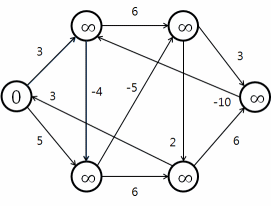

### Bellman-Ford

#### descriere
  * `Sursa unica` si `graf fara cicluri de cost negativ`
    * Solutie: `Bellman-Ford`
    * Drum de la `o sursa` la `toate celelalte noduri`. Graful trebuie sa aiba `costuri pozive`.
    * `Complexitate`:
      * `T = O(n * m)`
      * `S = O(n)` (coada)
  

#### lab
 
