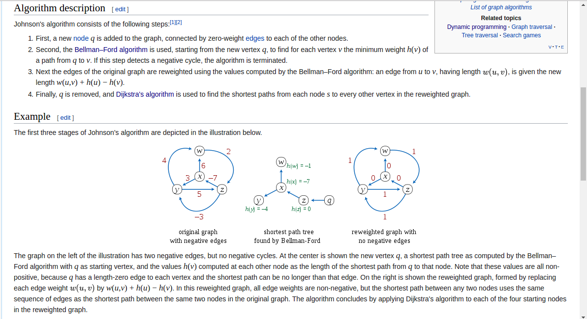

### Johnson

#### descriere
  * `Surse multiple` si `destinatii multiple` in `graf rar`
    * Drum de la oricare nod din graf la oricare alt nod din graf.
    * Solutie: `Johnson`
    * `Complexitate`:
      * `T = O(n * m  * log n + n * m)` (binary heap)
      	* `T = O(n^2 * log n + n * m)` (fibonacci heap)
      	  * Aceasta implementare bate RoyFlod pe grafuri `rare`.
      * `S = O(n ^ 2)` (d - distances)

#### lab
 
