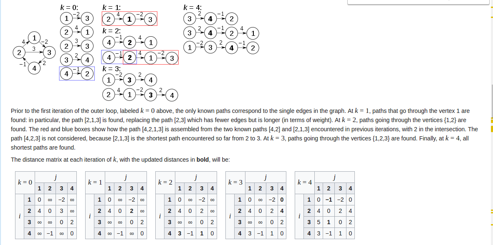

### Roy-Floyd

#### descriere
  * `Surse multiple` si `destinatii multiple` in `graf dens` cu `costuri oarecare`, DAR `fara cicluri negative`.
    * Drum de la oricare nod din graf la oricare alt nod din graf.
    * Soltutie:`Roy-Floyd`:
    * `Complexitate`:
      * `T = O(n^3)`
      * `S = O(n^2)` (d - distances) 
  

#### lab
 
