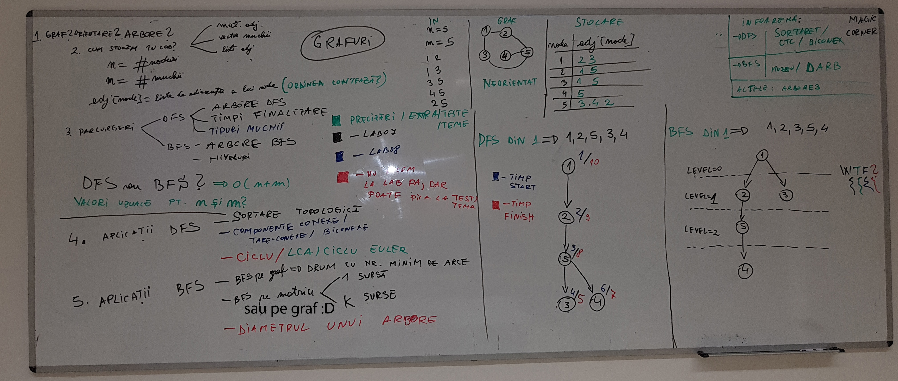

### skel_graph/traversal

#### context	
	
Cele doua modalitati de a traversa un graf:
	- in adancime 
	- in latime

  * DFS (Depth-First Search)   = parcurgere in adancime
  * BFS (Breadth-First Search) = parcurgere in latime

#### infoarena
 - [dfs](https://infoarena.ro/problema/dfs)
 - [bfs](https://infoarena.ro/problema/bfs)

#### lab
Toate pozele se gasesc in `_lab`.

 
