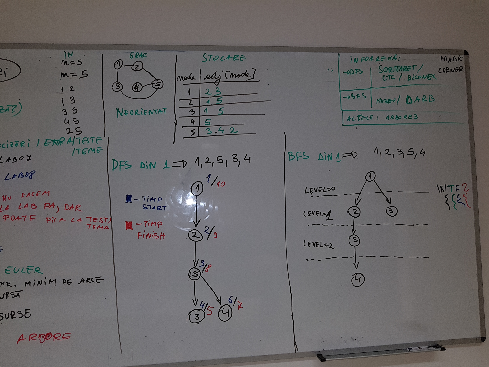

### skel_graph/traversal
	
	Cele doua modalitati de a traversa un graf:
	- in adancime 
	- in latime   
DFS (Depth-First Search)   = parcurgere in adancime
BFS (Breadth-First Search) = parcurgere in latime

